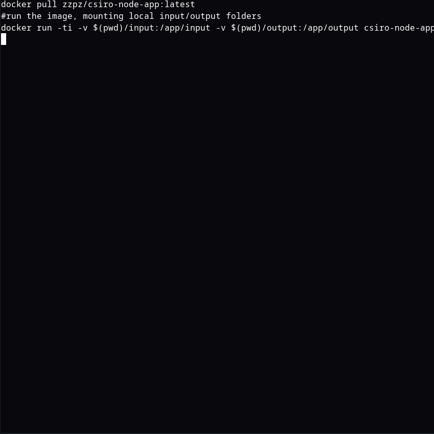

# csiro

[](https://github.com/zzpz/csiro/actions/workflows/docker.yml)

note: assumes docker installed and dockerhub/ghcr account configured and logged
in appropriately to pull image

## Examples

[Designing a system to integrate app into](diagrams/architecture.md)

[Example Architecture - Large](diagrams/example-architecture-large.png)

Example usage 

---

## Pull the image and run locally

```bash
#DockerHub
docker pull zzpz/csiro-node-app:latest
#run the image, mounting local input/output folders
docker run -ti -v $(pwd)/input:/app/input -v $(pwd)/output:/app/output csiro-node-app
```

or

```bash
#Github Container Registry
docker pull ghcr.io/zzpz/csiro-node-app:latest
#run the image, mounting local input/output folders
docker run -ti -v $(pwd)/input:/app/input -v $(pwd)/output:/app/output csiro-node-app
```

## Building and running locally

Build the node app

```bash
npm run build
```

Build the docker image

```bash
docker build . -t csiro-node-app
```

Run using qualified path input/output folders mounted in image

```bash
INPUT_FOLDER=$(pwd)/input
OUTPUT_FOLDER=$(pwd)/output
docker run -ti -v ${INPUT_FOLDER}:/app/input -v ${OUTPUT_FOLDER}:/app/output csiro-node-app
```

or Run using and mount input/output from current directory:

```bash
docker run -ti -v $(pwd)/input:/app/input -v $(pwd)/output:/app/output csiro-node-app
```
