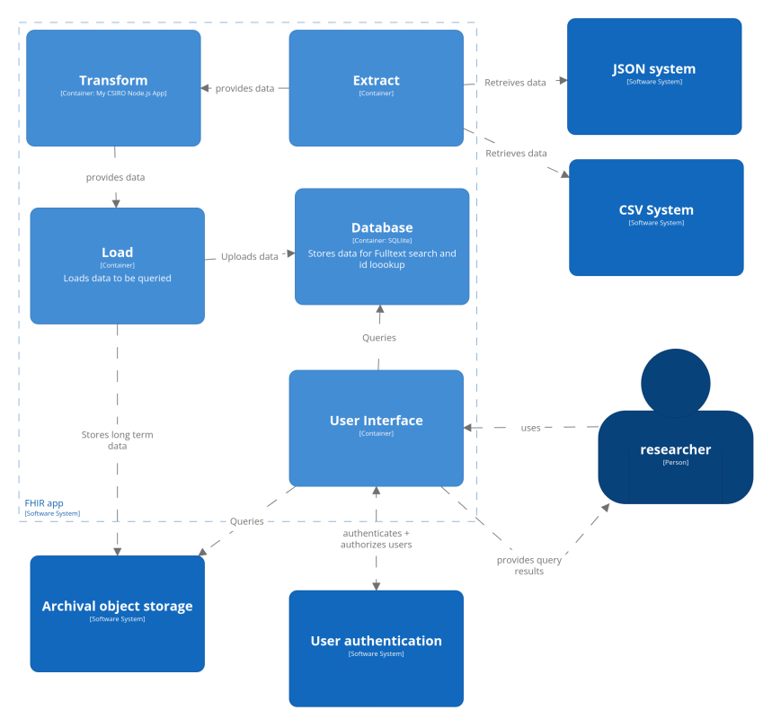

# Example Architecture Integrating Systems

There are a number of questions that I would ask the researchers before
developing this further. Questions concerning the longevity of the data,
expected updates or extensions to the dataset and the mapping of inputs to FHIR
fields. The answers are likely to inform the level of complexity and
sophistication in integrating these sources to be queried. Some examples are
below:

    - Is student number the performer of this diagnostic test or interpreter? 
    - Is it a point in time snapshot of the data or periodically extended?
    - Is the data updated such that a given record changes? 
    - Is the data queried for specific diagnoses or just having a confirmed diagnosis?
    - Is/can the data be pre-filtered when extracted (e.g. only genomic tests)

Regardless the system is essentially an ETL process shown in the example
architecture diagram below:

### **ETL**

Extraction is already performed, providing CSV and JSON files. These are
transformed by the application I have written into the FHIR standard and are
then uploaded to the relevant storage. Challenges arise concerning storage and
querying given the limited example data. Indexing the data on patientID is
unlikely to be of much use given the researchers stated goals. Also, the lack of
coding for the confirmed diagnoses and the inability to gaurantee exact text
matches (gitelman vs gitelman's) also makes a key-based index on confirmed
diagnosis field unlikely.

#### **Can we extend the data to make indexing easier?**

Ultimately I would ask the researchers if there is additional metadata that can
be included for indexing (diagnosis codes particularly). If not I would dump the
contents into a SQLLite database indexing on patientID and provide a full text
search over the confirmed and differential diagnoses fields. This should then
provide a fairly straight forward SQL querying capability. Depending on the
technical capabilities and access of the researchers and the lifecycle of the
data and its use I would consider including a simple user interface to query for
given paramaters in the database.

#### **If we can't extend the data can we do it ourselves?**

I would consider augmenting the tranformation process to attempt a best guess at
matching the diagnosis to its code if the data was going to be used long term. A
simple lookup of the seen fields mapped to their code would not take long to
create manually if the fields are consistent and only a handful are of concern.
A more sophisticated machine learning model could be used for mapping a highly
varied and poorly standardised confirmed diagnosis field to a best-guess code.

#### **Very large dataset**

If the data were very large and exceeded SQLite's capabilities then something
such as a Parquet file or Apache Spark reading JSON objects could be implemented
for querying. Elastic search could also provide a keyword search if the fields
being queried are long form text. These are not shown in the diagram.

#### **Researchers interface at different levels of complexity**

From the researcher's point of view the data is capable of being pulled into
other systems (pandas/R/etc) from either of a database query or a user interface
(api endpoint) with preset / ORM querying capabilities. The data is also capable
of being retrieved in a "raw" json format from object storage if desired.

#### **Ongoing update or insert to the data**

If the data is periodically extended (without update to previous data) then
ideally a delta could be used to only extract/insert those new records with a
test_time greater than the previous extract. If the data is updated then it
would be hoped that partial extracts of those updates can be performed.

#### **Fitness for purpose**

The exact implementation (including altering current transformation steps) would
depend heavily on the expected usage by the researchers. In the example
architcture above, assuming ~500,000 records and only extending the data SQLite
should be able to provide a full text search as well as a traditional key-based
search of the test type. Additionally ach component in the architecture can be
individually extended or replaced as necessary to meet any changing needs as
discussed.
